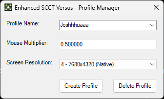

#  Enhanced SCCT Versus
A major patch for Splinter Cell: Chaos Theory's Versus mode, fixing bugs and exploits while improving gameplay and map balance.

For a full list of patch notes, refer to the [Patch Notes](PatchNotes.md) page.

## Installation
The latest version of Enhanced SCCT Versus can be found in the [Releases](https://github.com/Joshhhuaaa/EnhancedSCCTVersus/releases) page. Please note that versions of Enhanced SCCT Versus are not compatible with the default version of the game or previous Enhanced versions.

### Game Setup
- After downloading Enhanced SCCT Versus, extract the contents. You will then have an Enhanced SCCT Versus folder, which you can place anywhere you like since it's portable.
- By default, the game will be installed as a dgVoodoo2 build. If you would like to switch between dgVoodoo2 or 3D-Analyze, run the command script, `ConvertBuild.cmd` in the System folder.

### dgVoodoo2 build (DG) [recommended]
This is the recommended build that we have people use. [dgVoodoo2](https://github.com/dege-diosg/dgVoodoo2) is a wrapper that can restore the broken dynamic lights on modern video cards for SCCT Versus.

- Run the game executable, `SCCT_Versus.exe` in the System folder to begin playing. 

dgVoodoo2 offers smoother, less pixelated shadows than 3D-Analyze. However, some users experience an issue where their game starts tabbing out while clicking the mouse on dgVoodoo2. If that occurs, you can try using 3D-Analyze to fix the issue.

---

### 3D-Analyze build (3DA)
This is an alternate build that uses 3D-Analyze to fix the broken dynamic lights on modern video cards. 3D-Analyze is usually only recommended if having mouse issues with dgVoodoo2 or if you would like to use windowed mode.

- Run the command script, `Play SCCT_Versus.cmd` to begin playing.

The command script is in the root directory, it configures and runs the game executable under 3D-Analyze to fix the lighting.

---

### Creating a Profile
Players now have the option to adjust their [Mouse Multiplier](MouseMultiplier.md) directly in the profile configuration files. This allows for greater sensitivity control, potentially reducing pixel skipping and negative acceleration. As a result, creating profiles within the game is no longer supported. Instead, use the Profile Manager script located in the System folder.

- To create a profile, run the command script, `ProfileManager.cmd` in the System folder.
- Enter a profile name or choose an existing one from the dropdown menu. Then, enter your desired Mouse Multiplier setting and select your desired screen resolution preset.
- Lastly, click the "Create Profile" button to either create a new profile or update an existing one.

### Mouse Polling Rate
Many mice now offer polling rates of 1000 Hz or higher. However, in SCCT Versus, higher polling rates may cause issues with your mouse aim. If your mouse allows it, try setting the polling rate to 125 Hz through software.

### EAX Resotration (optional)
EAX enhances the game's audio using hardware acceleration to process advanced 3D environments. Since Windows Vista, Microsoft has stripped out the DirectSound3D API, preventing EAX from functioning.

- To restore EAX functionality, run the registry file, `eax_restore.reg` in the System folder and press "Yes" to the dialog to add the registry entries.

 This registry file registers `dsound.dll` in Windows, enabling EAX to function. Please note that this registry applies only to your specific Windows user. If you create a new Windows user, you'll need to run the registry file again to restore EAX.

 ## Playing Online
Ubisoft discontinued Chaos Theory's servers in April 2016. However, the multiplayer is still playable when using virtual LAN applications. The most common method in the community currently is to use [Radmin VPN](https://www.radmin-vpn.com/). It's easy to set up, and there's no need for account creation.

- Once Radmin VPN is installed, select "Network" > "Join Network." A window will appear, click on the "Gaming Network" tab, and join the `Splinter Cell 3 - Chaos Theory` or `Splinter cell: C.T` network.
- If you would like to change your username on Radmin VPN, select "System" > "Change Name" or simply double-click your username.
